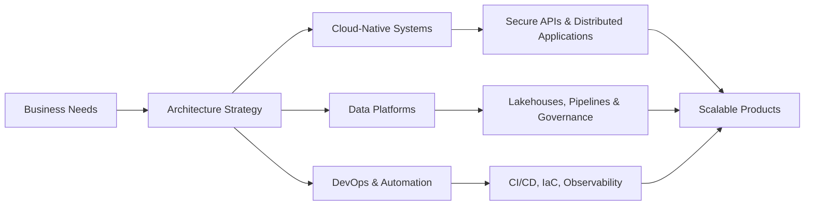

# 👨‍💻 Pedro Augusto Canedo Araujo Obalhe

### Software Architect · Tech Lead · Cloud & Data Engineering · DevOps

---

---

## 🚀 About Me

Sou **Arquiteto de Software e Tech Lead**, com atuação estratégica e hands-on em arquitetura corporativa, plataformas de dados, cloud engineering, backend, DevOps e modernização de sistemas críticos.

Atuo na definição de diretrizes arquiteturais, evolução de aplicações distribuídas, governança de soluções em nuvem, automação de infraestrutura, pipelines CI/CD, integração entre sistemas legados e modernos, além da construção de plataformas de dados escaláveis com foco em segurança, rastreabilidade, observabilidade e eficiência operacional.

Minha missão é conectar **negócio, engenharia e arquitetura** para transformar problemas complexos em soluções robustas, sustentáveis e preparadas para crescimento.

---

## 🧭 What I Do

| Área | Atuação |
| --- | --- |
| 🏗️ **Software Architecture** | Arquitetura corporativa, sistemas distribuídos, APIs, microsserviços, integração entre plataformas e modernização de legados |
| ☁️ **Cloud Engineering** | Soluções cloud-native em Azure, governança, segurança, escalabilidade, observabilidade e automação |
| 📊 **Data Engineering** | Data Lakes, Lakehouses, pipelines, Spark, ingestão de dados, processamento distribuído e governança |
| ⚙️ **DevOps & Platform Engineering** | CI/CD, IaC, containers, Kubernetes, automação de deploys, monitoramento e práticas de operação |
| 👥 **Technical Leadership** | Liderança técnica, mentoria, revisão arquitetural, definição de padrões e apoio à tomada de decisão |
| 🔐 **Governance & Security** | DevSecOps, compliance, controle de acesso, rastreabilidade, qualidade e confiabilidade de software |

---

## 🛠️ Tech Stack

### Languages & Backend

### Cloud, Data & DevOps

### Databases & Observability

---

## 🧩 Architecture Focus

---

## 💼 Professional Experience

<b>Software Architect · Montreal Oficial</b> · Jun 2026 - Present

 

Atuação como Arquiteto de Software na definição e evolução de arquiteturas corporativas para ambientes de nuvem, dados e aplicações críticas.

**Key responsibilities:**

- Definição de arquiteturas corporativas para aplicações distribuídas, plataformas de dados e soluções cloud-native.
- Liderança técnica de times multidisciplinares de Engenharia de Software, Dados, Cloud e DevOps.
- Arquitetura e governança de soluções utilizando Microsoft Azure, Microsoft Fabric e ecossistemas de dados em larga escala.
- Definição de padrões de desenvolvimento, integração, segurança, observabilidade e qualidade de software.
- Revisão arquitetural de iniciativas estratégicas e apoio à tomada de decisões tecnológicas.
- Governança de ambientes cloud, automação de infraestrutura e pipelines CI/CD.
- Aplicação de práticas de DevSecOps, FinOps, arquitetura orientada a eventos e engenharia de plataformas.
- Modernização de sistemas legados, evolução tecnológica e definição de roadmaps arquiteturais.

<b>Tech Lead · Montreal Oficial</b> · Feb 2025 - Jun 2026

 

Liderança técnica de equipes multidisciplinares, com foco em arquitetura, dados, cloud, backend, DevOps e modernização de sistemas corporativos.

**Key responsibilities:**

- Arquitetura e implantação de plataformas de dados em cloud.
- Construção de Data Lakes, Lakehouses, pipelines de ingestão e processamento com Spark.
- Integração de múltiplas fontes estruturadas, semiestruturadas e não estruturadas.
- Modernização de sistemas corporativos, aplicações web e mobile.
- Desenvolvimento e governança de APIs corporativas e integrações com sistemas legados.
- Automação de deploys, CI/CD, infraestrutura como código, containers e Kubernetes.
- Boas práticas de governança, compliance, segurança, rastreabilidade e observabilidade.

<b>Senior Software Engineer · DevOps Engineer · Montreal Oficial</b> · Sep 2024 - Feb 2025

 

Atuação como engenheiro backend sênior com responsabilidades em DevOps, focado em soluções escaláveis, pipelines de dados e ambientes cloud.

**Key responsibilities:**

- Desenvolvimento backend com Python, SQL e integrações corporativas.
- Implementação de pipelines CI/CD com Azure DevOps.
- Automação de infraestrutura como código com ARM Templates.
- Arquitetura de dados com Data Lake, SQL Data Warehouse e Databricks.
- Experiência com Big Data, incluindo Hadoop, Spark e Kafka.
- Segurança de dados, criptografia, privacidade e conformidade.
- Atuação com bancos relacionais, bancos não relacionais e fontes de dados heterogêneas.

<b>Software Engineer · MáximaTech</b> · May 2024 - Sep 2024

 

Desenvolvimento de soluções backend e frontend para sistemas corporativos, atuando em manutenção, evolução e criação de novas funcionalidades.

**Tech stack:** .NET Core, C#, ASP.NET, RabbitMQ, Docker, Oracle SQL, PostgreSQL, Angular, React.js, PWA.

<b>DevOps Specialist · Conveste Serviços Financeiros</b> · Jul 2023 - May 2024

 

Atuação em automação, infraestrutura, cloud, observabilidade e melhoria contínua de processos de engenharia.

**Key responsibilities:**

- Automação de CI/CD com Azure DevOps.
- Orquestração de containers com Kubernetes e Docker.
- Implementação de logging, monitoramento e práticas de observabilidade.
- Contribuições em arquitetura de software e cloud engineering.
- Promoção de cultura DevOps, colaboração e práticas ágeis.

<b>Full Stack Developer · DevOps · Conveste</b> · Jan 2021 - Jul 2023

 

Atuação full stack com forte envolvimento em DevOps, arquitetura, integração de sistemas, dados e automação.

**Tech stack:** C#, .NET, JavaScript, Python, PHP, React, Material UI, Next.js, FastAPI, Django, Kubernetes, Docker, Azure DevOps, Kafka, SQL Server e Oracle.

**Engineering practices:** DDD, TDD, Clean Code, Scrum, APIs, integração entre sistemas e arquitetura orientada a eventos.

<b>Developer · DevOps · H.Tech Consultoria</b> · Jan 2019 - Jan 2021

 

Atuação em desenvolvimento, cloud, automação de infraestrutura e implantação de ambientes com foco em confiabilidade e eficiência operacional.

**Key responsibilities:**

- Pipelines CI/CD com Azure DevOps.
- Infraestrutura em Azure.
- Automação com ARM Templates e Terraform.
- Monitoramento com Azure Monitor e Application Insights.
- Segurança e conformidade em ambientes cloud.

---

## 🎓 Education

**MBA em Engenharia de Software**  
FAMEF · Oct 2023 - Jan 2025

**Tecnologia em Análise e Desenvolvimento de Sistemas**  
Pontifícia Universidade Católica de Goiás · Jan 2021 - Apr 2024

---

## 📊 GitHub Analytics

---

## 🏆 GitHub Trophies

---

## 🎯 Current Focus

- Arquitetura de software corporativa e modernização de sistemas críticos.
- Plataformas de dados com Azure, Microsoft Fabric, Spark e Lakehouse Architecture.
- Cloud-native applications, Kubernetes, CI/CD, IaC e observabilidade.
- DevSecOps, FinOps, governança, compliance e segurança de dados.
- Inteligência Artificial aplicada, RAG, automação e ferramentas para desenvolvedores.
- Open-source, engenharia de plataformas e soluções escaláveis.

---

## 🤝 Let's Connect

**Aberto para trocar ideias sobre arquitetura, cloud, dados, DevOps, IA aplicada e engenharia de software.**

 

---

### ⚡ Building scalable systems. Leading technical decisions. Turning complexity into architecture.

